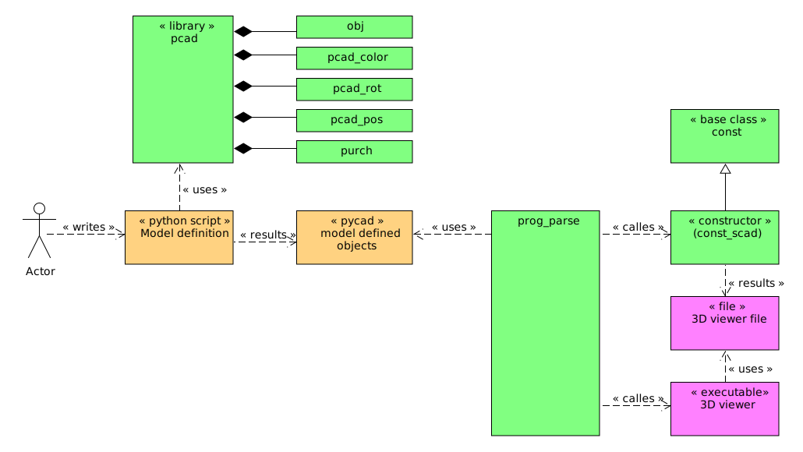

# General
## Base principle

Pycad is a framework for define and generate 3D model in python. The model definitions results pycad based objects. This objects are converted with a constructor for a 3D viewer (e.g. openscad)

## How to use

# Pycad library
## objects
### cube
