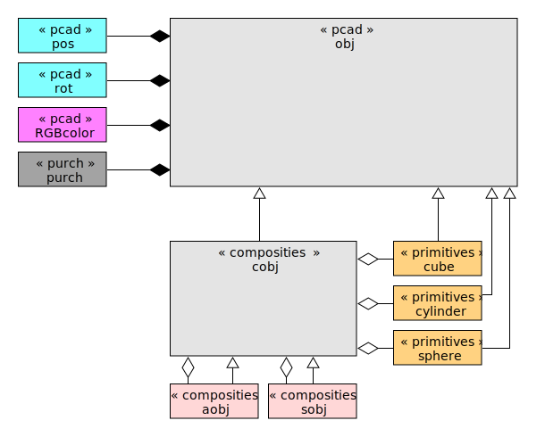

# Table of content
- [Table of content](#table-of-content)
- [General](#general)
  - [Base principle](#base-principle)
- [How to use](#how-to-use)
- [Directory structure](#directory-structure)
  - [const](#const)
  - [obj](#obj)
    - [composites](#composites)
    - [primitives](#primitives)
    - [dimension](#dimension)
    - [constructives](#constructives)
  - [pcad](#pcad)
    - [pcad.py](#pcadpy)
    - [pcad\_obj.py](#pcad_objpy)
    - [pcad\_pos.py](#pcad_pospy)
    - [pcad\_color.py](#pcad_colorpy)
  - [pcad\_types](#pcad_types)
  - [prog](#prog)
  - [purch](#purch)
  - [test](#test)
- [Pycad library](#pycad-library)
  - [3D - objects](#3d---objects)
  - [Class hierarchies 3D objects](#class-hierarchies-3d-objects)
    - [obj](#obj-1)
      - [Description](#description)
      - [Arguments](#arguments)
    - [composites](#composites-1)
      - [aobj](#aobj)
        - [Description](#description-1)
        - [Arguments](#arguments-1)
      - [sobj](#sobj)
        - [Description](#description-2)
        - [Arguments](#arguments-2)
        - [Common methods](#common-methods)
        - [Special methods](#special-methods)
          - [copy](#copy)
      - [cobj](#cobj)
        - [Description](#description-3)
        - [common method add](#common-method-add)
    - [Primitives](#primitives-1)
      - [cube](#cube)
      - [sphere](#sphere)
      - [cylinder](#cylinder)
- [ToDo's](#todos)

# General
## Base principle

Pycad is a framework for define and generate 3D model in python. The model definitions results pycad based objects. This objects are converted with a constructor for a 3D viewer (e.g. openscad)


# How to use
For usage the pycad library a own python script has to be written like in the example below:

```
import sys
sys.path.append("../")

import pcad.pcad as pcad
import prog.prog_parse as prog_parse

cube = pcad.aobj("cube_")
cube.add(pcad.cube(10, 10, 10))
cube.add(pcad.Dimensioning(pcad.Point(0,10,0),pcad.Point(10,10,0),plane="yx",text="yx"))

prog_parse.exam_execute([cube])    
```
The script imports the pycad libray and a helper for made the script executable. 

At first a *aobj* "cube_" is initialized. The *aobj* (additional object) is a object which groups a lot of objects to one object. In this example, the *aobj* includes a primitive object *cube* and a *dimensioning* object. The *dimensioning* is in pycad a normal constructive element.  

The *aobj* "cube_" is given in a list the *exam_execute* methode of *prog_parse*. The *exam_exceute* provides a complete console based frontend for display the model. In case the script is saves as "test_cube.py" the call:

```
python test_cube.py -h
```

results:

```
$ python test_cube.py -h
usage: test_cube.py [-h] [--scad [SCAD]]

Process some integers.

options:
  -h, --help     show this help message and exit
  --scad [SCAD]  activate scad with option program path
```
At default, the program *openscad* is set as constructor. with a additional option, the path to openscad can be set. 

```
$ python test_cube.py
```

results a file *test_cube.scad* and the call of openscad with this file.

# Directory structure
## const
The const directory includes the constructor classes.
## obj
The *obj* directory includes the objects supported by pycad library.
### composites
The *composites* directory includes sources for [*aobj*](#aobj), [*sobj*](#sobj) and [*cobj*](#cobj)
### primitives
The *primitives* directory includes sources for [*cube*](#cube), [*sphere*](#sphere) and [*cylinder*](#cylinder).
### dimension
The *dimension* directory includes sources for define dimension items.
### constructives
The *constructive* directory includes sources for create special composite objects like traverses.

## pcad
The *pcad* directory includes the source for the base definitions of the library.
### pcad.py
The pcad.py imports all important basic modules for use the pycad library.
### pcad_obj.py
The pcad_obj.py provides the parent class for all 3D objects of pycad
### pcad_pos.py
The pcad.py provides the position and rotation attribute, which are part of each 3D object.
### pcad_color.py
The pcad_color.py provides the color attribute for each 3D object

## pcad_types
The pcad_types directories provides types for intern use of pycad library

## prog
The prog directory provides sources with helper classes for realize a cmd line application for generating the defined 3D-Model

## purch
The purch directory provides sources with the purch classes. This supports generate a purchase list with the need parts for realize the modelled construction.

## test
The test directory provides source for testing single parts of the pycad library.

# Pycad library
## 3D - objects
## Class hierarchies 3D objects


The *obj* from the module *pcad_obj* is the parent class of all 3D objects. The *cobj* class is the parent class for all composite classes (*aobj*, *sobj*). This includes primitive classes (*cube*, *cylinder*, *sphere*) at least once of it. 
### obj
#### Description
All base objects inherits from the *obj* class. The *obj* class is NOT part of the user interface.
#### Arguments
```
name (str, optional): Name of object. Defaults to None.
pos (pos, optional): position of object. Defaults to pos().
rot (rot, optional): rotation of object. Defaults to rot().
color (RGBColor, optional): color of object. Defaults to RGBColor().
info (str, optional): additional information of object. Defaults to "".
purch (purch, optional): purchase information of object. Defaults to None.
```
### composites
The composites objects groups objects in addition or differences to one object. 
#### aobj
##### Description
The *aobj* is the "additional object". An additional object groups objects in addition.
##### Arguments 
    name (str, optional): name ob object. Defaults to None.
    pos (pos, optional): position of object. Defaults to pos().
    rot (rot, optional): rotation of . Defaults to rot().
    info (str, optional): general information. Defaults to "".
    purch (_type_, optional): purchase information. Defaults to purch.
    args: objects to add
#### sobj
##### Description
The *sobj* is the "subtractive object". A subtractive object groups objects with a initial (first object). All further objects are subtract from this.
##### Arguments
    name (str, optional): name ob object. Defaults to None.
    pos (pos, optional): position of object. Defaults to pos().
    rot (rot, optional): rotation of . Defaults to rot().
    info (str, optional): general information. Defaults to "".
    purch (_type_, optional): purchase information. Defaults to purch.
    args: objects to add
##### Common methods
see [cobj](#cobj)
##### Special methods
###### copy
returns a deep copy from the object
#### cobj
##### Description
The *cobj* is the parent class from *aobj* and *sobj* and not determined for usage
##### common method add
The add method add's a object to the 
### Primitives
The primitives objects are basic objects.
#### cube
#### sphere
#### cylinder

# ToDo's
- Diminsionig swichable